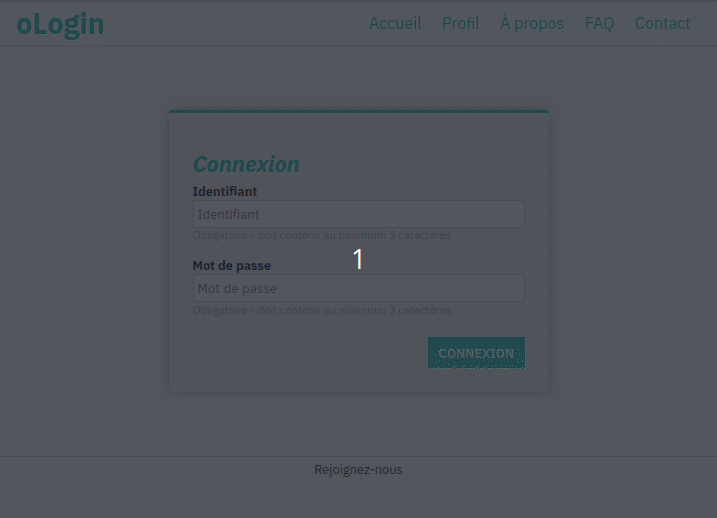

# oLogin : Front

Il est temps de commencer à intéragir avec nos utilisateurs.

On commence doucement avec un formulaire de connexion.

## Objectifs

1. Réaliser l'intégration
    - En respectant la charte proposée plus bas
  
2. Mettre en place une validation des champs
    - Chaque champ doit contenir au moins 3 caractères pour être valide
    - Lorsque l'on change de champ, une classe doit être appliquée sur le champ (valide : bordure verte, invalide : bordure rouge)

3. À la soumission du formulaire
    - Chaque champ doit être validé
    - Si il y a des erreurs, on empêche la soumission
    - Si il y a des erreurs, on les affiche dans le formulaire
    - Si aucune erreur, on soumet le formulaire normalement

## Charte

### Fonts

IBM Plex Sans, avec les variantes :
- normal
- bold
- bold italic

### Couleurs

- Couleur de fond de page : blanc : #fff
- Couleur de fond de zone de contenu : gris très léger : #fafafa
- Couleur de fond du formulaire : gris léger : #f1f1f1
- Couleur des bordures : gris : #ccc
- Vert : #00d1b2
- Rouge/Rose : #ff3860
- Ombre portée : sur 20px => gris : #aaa
- Contenus : noir : #000
- Notes sous les champs : gris : #999

## Whaaaaat ???

### HTML / CSS

- `display: flex` est un allié précieux [**mdn** flex](https://developer.mozilla.org/en-US/docs/Web/CSS/flex)
- [**mdn** box-shadow](https://developer.mozilla.org/en-US/docs/Web/CSS/box-shadow) peut aider pour la présentation du formulaire
- La gestion des couleurs pour les champs peut passer par l'usage d'une classe CSS

### JavaScript

- Pour travailler avec plusieurs champs, une boucle semble être un moyen idéal
- Stocker plusieurs erreurs pourrait passer par un tableau
- Écouter le changement de champ pourrait passer par [**mdn** blur](https://developer.mozilla.org/en-US/docs/Web/Events/blur)
- Pour empêcher la soumission d'un formulaire, [**mdn** preventDefault](https://developer.mozilla.org/en-US/docs/Web/API/Event/preventDefault) est nécessaire
- Pour sélectionner de multiples éléments du DOM, [**mdn** getElementsByClassName](https://developer.mozilla.org/en-US/docs/Web/API/Document/getElementsByClassName) ou [**mdn** querySelectorAll](https://developer.mozilla.org/en-US/docs/Web/API/Document/querySelectorAll) sont parfait
- [**mdn** innerHTML](https://developer.mozilla.org/en-US/docs/Web/API/Element/innerHTML) est pensé pour insérer du contenu HTML dans le DOM

## BONUS

### ... qui pique

Plutôt que de gérer les classes CSS ajoutées au DOM par `className` vouos pourriez utiliser `classList`

- [**mdn** classList](https://developer.mozilla.org/en-US/docs/Web/API/Element/classList)

### ... de la mort

Au lieu d'utiliser `innerHTML` ou `textContent` pour ajouter du contenu dans le DOM, vous pouvez créer un élément du DOM de toute pièce (par la programmation) par exemple créer des `
 ...` directement dans le JS :scream:

- [**mdn** createElement](https://developer.mozilla.org/en-US/docs/Web/API/Node/appendChild)
- [**mdn** appendChild](https://developer.mozilla.org/en-US/docs/Web/API/Node/appendChild)